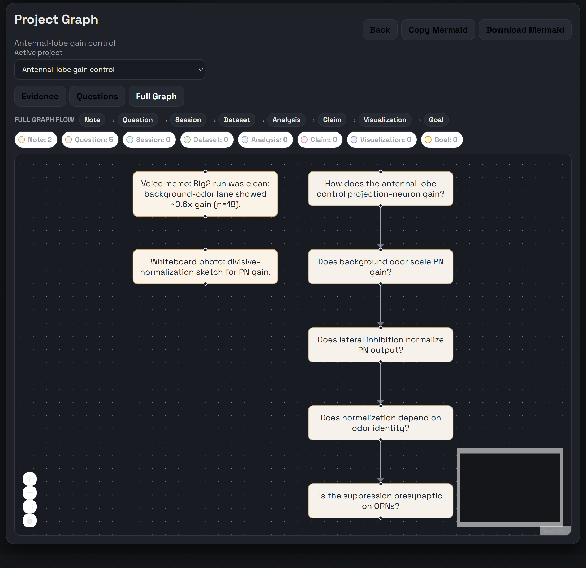
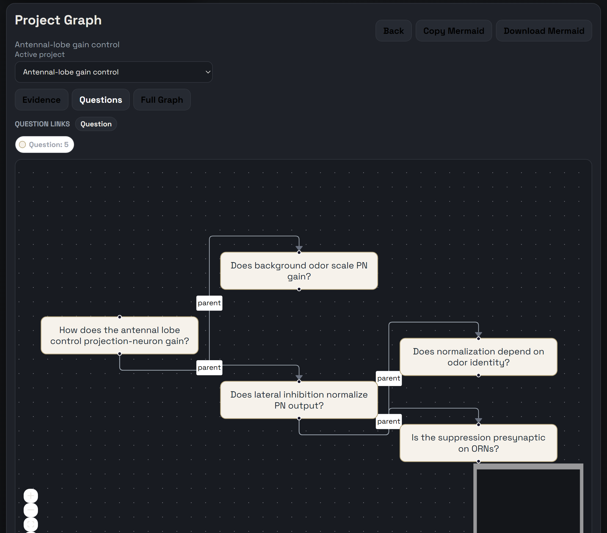
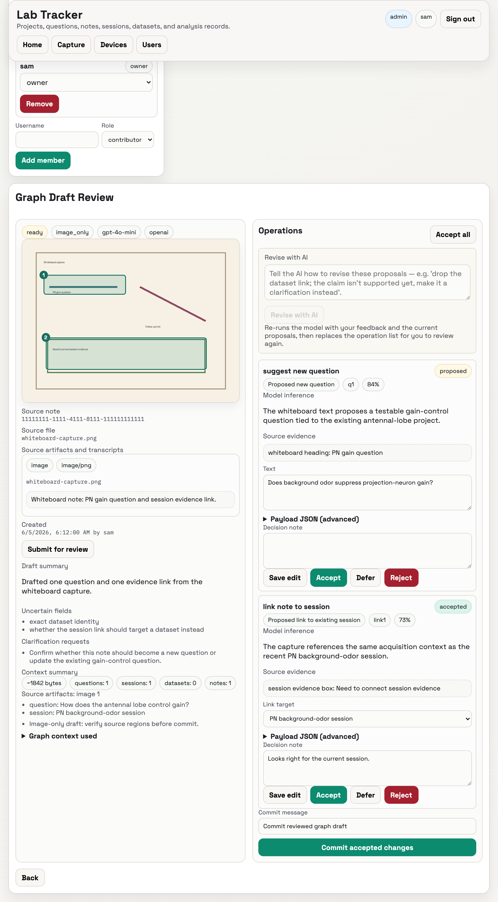

# Lab Tracker

A file named `2025_12_10_Rig2_session001.nwb` tells you *when*, *where*, and *what* — but not *why* you collected it, what you expected, or what you actually saw at the bench. That reasoning lives on paper towels, on whiteboards, and in people's heads — and it walks out the door when they do. Lab Tracker gives it a durable place to live, next to the data.

## See it live

**[Open the read-only demo →](https://samuelbrudner.github.io/lab-tracker/app/)** — seeded fly-olfaction data, no install, no login. Click around for 60 seconds.

The whole project as a graph — questions, sessions, datasets, and the notes that connect them:

Questions are first-class. You see how a broad question breaks down into the atomic ones you can actually answer at the rig:

Snap a photo or record a voice note from your phone, and Lab Tracker drafts the graph changes. You edit and accept — nothing touches your record until you do:

## What you can do

- **Write down the question first.** Create questions, stage and activate them, and link a broad question down to the small ones you can answer — so the *why* is a durable record, not a buried comment.
- **Capture at the bench.** Add notes as text, file attachments, or voice notes (with transcripts you can edit), pinned to the project, question, session, dataset, analysis, or claim they describe.
- **Track what happened at the rig.** Log acquisition sessions, then turn a finished one into a dataset — every dataset commit records its provenance automatically.
- **Connect findings to evidence.** Analyses, claims, and visualizations are explicit records that link back to the datasets and questions they answer.
- **Draft from your phone, accept on review.** From a photo or voice note, Lab Tracker proposes graph changes from your project's context. You edit, accept, and commit through the same checks as any normal write — no silent automation. AI can suggest; only a person commits.
- **Find old context later.** Keyword search runs across your questions and notes, so context you captured months ago is findable when you need it.

## Who it's for

Wet labs — initially neuroscience — that generate high-bandwidth data on specialized rigs and want the reasoning preserved alongside it. If you've ever inherited a folder of `.nwb` files with no idea why they exist, this is for you.

## Scientists start here

No install. No terminal.

- **Just looking?** [Open the demo](https://samuelbrudner.github.io/lab-tracker/app/) — read-only, seeded data, no login.
- **Your lab already runs it?** Open the link your admin gave you. Local instances start with sign-in off, so you can jump straight into `/app`. Where sign-in is on, public sign-up creates a viewer account — ask your admin for editor access to write.
- **Capturing from your phone?** Pair it from the **Devices** page, then use the capture link. See the [phone capture quickstart](docs/phone-capture-quickstart.md).

That's it. The rest of this page is for whoever sets it up.

## Set it up for your lab

This part is for the lab member or IT contact comfortable installing software. Two common paths, no terminal required for the first:

- **Hosted, zero-terminal:** one click provisions a managed instance with a web URL, managed Postgres, and first-admin setup in the browser.

  

- **Run it locally:** `lab-tracker serve` runs migrations, opens http://127.0.0.1:8000/app, and starts the server. There are double-click launchers for macOS and Windows in [`launchers/`](launchers/).

Full install, configuration, and deployment instructions live in the docs below — start with the [setup guide](docs/setup.md).

## What ships today

What ships today is the minimum that preserves the core research record. The authoritative list of what's supported is **[docs/retained-v1-surface.md](docs/retained-v1-surface.md)** — if this README disagrees with it, that document wins. The broader vision (OCR, semantic search, PI review gates) lives in [idea.md](idea.md) and is explicitly deferred.

## Documentation

**Set it up**
- [Local setup, run, and validate](docs/setup.md) — install, `lab-tracker serve`, frontend build, migrations, tests
- [Configuration reference](docs/configuration.md) — every `LAB_TRACKER_*` variable, optional AI/transcription config, and auth behavior
- [Windows fresh-clone setup](docs/windows-fresh-clone.md) — PowerShell install plus Beads/Dolt bootstrap

**Deploy and run it for a lab**
- [Deployment options](docs/deployment-options.md) — choose between launcher, Docker/Postgres, and managed cloud
- [One-click cloud deploy (Render)](docs/one-click-cloud-deploy.md) — managed instance with browser invites and first admin
- [Self-hosted operations](docs/self-hosted-operations.md) — Docker/Postgres backup, restore, upgrade, and first-admin setup
- [Serve the shared graph on a LAN/VPN](docs/lan-shared-graph.md) — one live Postgres graph for browsers, scripts, and assistants

**Capture and integrate**
- [Phone capture quickstart](docs/phone-capture-quickstart.md) — pair a phone for LAN capture
- [Evidence source metadata](docs/evidence-source-metadata.md) — import a synced folder as staged evidence notes with `lt import-folder`
- [MCP server, skills, and Dolt mirror](docs/lab-tracker-mcp-skills.md) — wire up assistants and the export-only versioned mirror

**Scope and vision**
- [Supported v1 surface (authoritative)](docs/retained-v1-surface.md) — the definitive list of what ships
- [Deferred long-term vision](idea.md) — OCR, vector search, and PI review gates, explicitly out of v1
