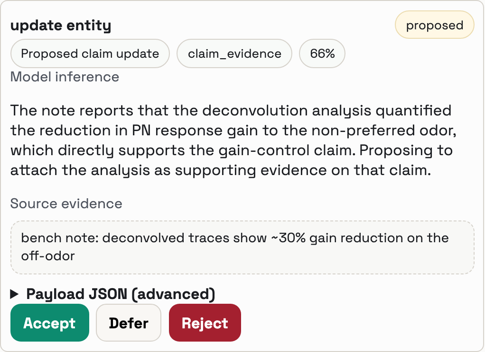

# Lab Tracker

**Lab Tracker turns the notes, photos, voice memos, and figures you already
produce into a connected account of what changed, why it mattered, and what
evidence supports it—so next week's meeting and next year's report start from a
scientific thread already assembled.** Capture evidence while you work, let AI
propose where it belongs, and decide what enters the durable record yourself.

A file named `2025_12_10_Rig2_session001.nwb` says when and where it was
collected. It rarely says *why* it exists, what you expected, or what you
learned. That reasoning lives on whiteboards, on paper towels, and in people's
heads—and walks out the door when they do. Lab Tracker gives it a queryable home
alongside projects, questions, sessions, datasets, analyses, claims, and
visualizations.

[**Read-only demo**](https://samuelbrudner.github.io/lab-tracker/app/) ·
[**Deploy to Render**](https://render.com/deploy?repo=https://github.com/SamuelBrudner/lab-tracker) ·
[**Documentation**](#documentation) · [**Run locally**](#run-locally)

> **Status:** Lab Tracker is at `0.1.0` and under active development. It is
> intended for evaluation and early research use; interfaces and deployment
> defaults may still change. The
> [supported v1 surface](docs/retained-v1-surface.md) is authoritative.

## The payoff: start from an assembled record

Author and time-window filters let an authorized assistant assemble what a
person committed within a period: sessions, datasets, analyses, figures,
claims, and notes. That can become the evidence packet for a progress report,
grant renewal, trainee meeting, lab meeting, or committee update. You supply
the window—Lab Tracker does not own the meeting calendar—and the assistant
starts from your curated record instead of a blank page.

The result is only as complete as what the lab captured and committed. Lab
Tracker does not invent missing experiments or evidence, and assistant-written
prose remains a draft to verify against the underlying graph.

## From capture to durable context

The core loop is deliberately small:

1. **Capture.** Send a text note, photo, voice note, or photo-and-voice bundle
   from the browser or a paired phone. In Python, `lab_tracker_client.savefig`,
   `capture_figures()`, and `run_context()` stage figures with content hashes
   and git context; MATLAB has `labtracker.savefig`. The `lt watch`, `lt repo`,
   and `lt hpc` adapters keep durable local outboxes for folder, repository,
   and Slurm evidence, then sync compact records when the API is reachable.
   Large source artifacts can remain in their original data store.
2. **AI proposes.** For an individual image note, the configured vision-capable
   model receives the image itself and can use visible text, handwriting, plots,
   and diagrams as context—there is no separate OCR-to-transcript step first.
   Scheduled batch drafts use the available text, voice transcripts, capture
   hints, links, and metadata. Both paths propose typed graph changes with
   rationale, confidence, and source references; neither creates canonical
   graph records.
3. **A person decides.** The review assignee can edit, accept, or reject
   individual operations, or ask the model to revise the draft. A project owner
   commits the accepted operations. **No AI-proposed graph change is committed
   until a person accepts it**, and non-interactive service or automation
   principals cannot accept, bulk-accept, or commit. Acceptance provenance
   distinguishes individually selected operations from bulk acceptance.
4. **Retrieve and export.** Search the record, inspect the project graph, ask
   an MCP-capable assistant for bounded decision context, or export PROV-O /
   JSON-LD provenance and plaintext sidecars that can travel with the data.

Direct human work is intentionally different from AI output. A person with
project contributor access can create and commit datasets, analyses, claims,
and visualizations without a mandatory second-person approval step. The human
gate protects the record from machine-authored changes; it is not a universal
peer-review workflow.

<p align="center">
  
</p>

## The daily review is part of the science

The daily review is the human half of the system: time set aside to return to
the work, notice what changed, test the model's interpretation, connect results
to the questions that made them worth collecting, and decide what remains
uncertain. That reflection is scientific work in its own right—often the part
bench work leaves too little room for—so Lab Tracker is built to support
attention rather than rush it.

Review proposals one at a time when they deserve close attention, or use bulk
acceptance for routine items. The record preserves which review mode you used,
so bulk acceptance is never represented later as individual review. Proposal
preparation can run on a schedule; judgment cannot. Some reviews take minutes,
and some science deserves longer.

Captured notes stay staged and visible until they are incorporated or archived
with a reason. If you skip a review, the captures wait for you and the coverage
gap remains inspectable instead of silently making the record look complete.

## Questions are the spine, not a claim that everything is complete

Lab Tracker starts with the questions a project is trying to answer. Broad
questions can branch into atomic experimental, method, control, and analysis
questions, and a question may have more than one parent.

The schema enforces a few important links:

- A dataset must name one primary question; secondary question links are
  optional.
- An analysis must name its source dataset or datasets.
- A visualization must name its analysis.
- A claim marked `supported` must cite a dataset or analysis as evidence.

Other useful links remain optional. Claims do not universally have to answer a
question, visualizations do not universally have to name a related claim, and
notes can target the most relevant retained entity. That distinction matters:
Lab Tracker makes provenance explicit where it exists without pretending that
every historical record arrived fully connected.

## What ships today

- **Research context:** projects and lab groups, role-based access, question
  graphs, notes, sessions, datasets, analyses, claims, visualizations, goals,
  and exploration records for decisions, dead ends, and pivots.
- **Evidence capture:** browser and paired-device capture, raw files and
  editable voice transcripts, Python and MATLAB figure capture, and
  offline-first watch-folder, repository, and HPC adapters.
- **Human-gated drafting:** note-scoped and batch graph drafts, scheduled or
  run-now drafting, accept/edit/reject review, and durable curation provenance.
- **Retrieval and portability:** substring search, project graph views,
  permission-bounded assistant context, publication-readiness checks,
  provenance export, and hash-verified external artifact references.

Lab Tracker owns the question-and-provenance spine. It integrates with data
stores, analysis repositories, experiment trackers, and ELNs rather than trying
to replace them.

## Run locally

The shortest source install on macOS or Linux uses
[uv](https://docs.astral.sh/uv/):

```bash
git clone https://github.com/SamuelBrudner/lab-tracker.git
cd lab-tracker
uv venv
source .venv/bin/activate
uv pip install -e .
lab-tracker serve
```

`lab-tracker serve` applies migrations, snapshots a file-backed SQLite database
before migrating it, opens `http://127.0.0.1:8000/app`, and starts the server.
Windows instructions and development dependencies are in the
[setup guide](docs/setup.md). Double-click macOS and Windows launchers live in
[`deploy/launchers/`](deploy/launchers/).

SQLite is the convenient single-client local default. Use Postgres, enable
authentication, and establish backups for a shared or hosted lab instance; see
[deployment options](docs/deployment-options.md) and
[self-hosted operations](docs/self-hosted-operations.md).

For a no-terminal hosted start:

[](https://render.com/deploy?repo=https://github.com/SamuelBrudner/lab-tracker)

## Configure AI only if you want drafting

The graph and direct human workflows work without an AI provider. Graph
drafting supports three server-side providers:

| Provider | Draft setting | Voice transcription |
| --- | --- | --- |
| OpenAI | `openai` | Yes |
| Anthropic (Claude) | `anthropic` or `claude` | No |
| Google (Gemini) | `google` or `gemini` | Yes |

Set `LAB_TRACKER_GRAPH_DRAFT_PROVIDER` and the matching server-held API key.
With a vision-capable model, each provider can draft directly from an individual
image note or figure as well as text. Scheduled batch drafts currently use
text, voice transcripts, capture hints, links, and metadata rather than image
bytes. Voice transcription is a separate, explicit note action—not an automatic
upload step—and currently requires OpenAI or Google; Anthropic can draft from a
transcript created another way.

Any MCP-capable coding agent can read the same permission-bounded context.
`lab_tracker init` scaffolds common client configurations, and the policy stays
the same across vendors: agents may suggest and stage when asked, but they do
not operate the human commit gate. Follow the
[AI and agent setup guide](docs/agent-setup.md) for credentials, scheduling,
MCP, and verification.

## Documentation

- **Start and deploy:** [local setup](docs/setup.md) ·
  [deployment options](docs/deployment-options.md) ·
  [configuration](docs/configuration.md)
- **Capture and integrate:** [phone capture](docs/phone-capture-quickstart.md) ·
  [watch folders](docs/watch-folder-capture.md) ·
  [acquisition collections](docs/acquisition-collections.md) ·
  [MATLAB integration](docs/lab-tracker-matlab.md) ·
  [provenance export](docs/provenance-export.md)
- **Understand the model:** [vision](docs/vision.md) ·
  [review and commit](docs/review-and-commit-model.md) ·
  [supported v1 surface](docs/retained-v1-surface.md)
- **Operate AI drafting:** [agent setup](docs/agent-setup.md) ·
  [scheduled review](docs/scheduled-daily-review.md)

## Caveats

- This repository does not currently declare an open-source license. Public
  source availability should not be read as permission to redistribute it.
- Standalone OCR-to-transcript workflows, semantic/vector search, automatic
  transcription on every upload, and a standing system-selected extraction
  inbox are outside the supported v1 surface. Individual image-note drafting
  remains multimodal.
- Full research artifacts often remain outside Lab Tracker. External resolution
  is opt-in, read-only, bounded, and hash-checked; operators must configure the
  allowed roots or remotes.
- A shared deployment is an operated service: the lab remains responsible for
  provider approval, credentials, access policy, database backups, and durable
  file storage.
