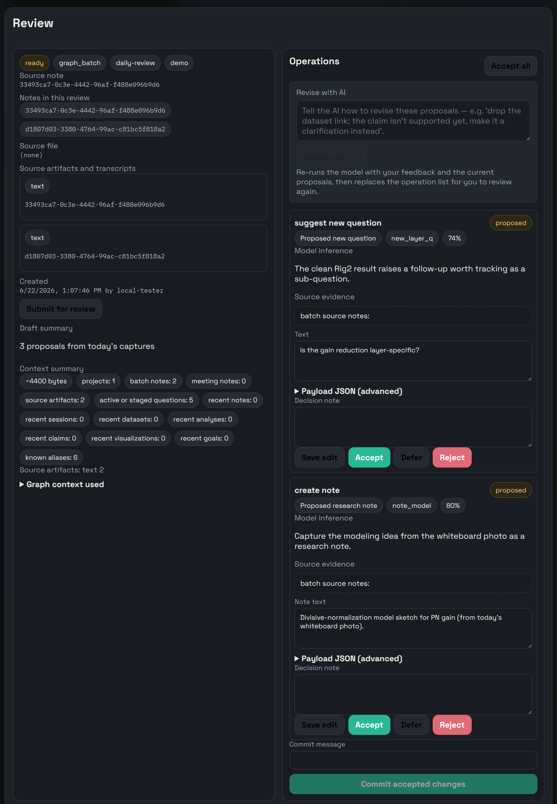

# Lab Tracker

A file named `2025_12_10_Rig2_session001.nwb` tells you *when*, *where*, and *what* — but not *why* you collected it, what you expected, or what you actually saw at the bench. That reasoning lives on paper towels, on whiteboards, and in people's heads — and it walks out the door when they do. Lab Tracker gives it a durable place to live, next to the data.

**[Open the read-only demo →](https://samuelbrudner.github.io/lab-tracker/app/)** — seeded fly-olfaction data, no install, no login. Click around for 60 seconds.

## Start with the question graph

The spine of every project is a graph of **questions** — your broad motivating question at the top, broken down into the atomic ones you can actually answer at the rig. Questions are first-class: you write them down *first*, before any data exists, and they persist whether the experiment works or not. A question can roll up to more than one parent, so the structure branches and converges as your thinking does.

## Everything hangs off a question

Once the questions exist, the rest of your record points back at them:

- **A dataset must name the question it addresses** — you can't commit one without it. Tag secondary questions too, and mark whether the data supported, refuted, or was inconclusive for each.
- **Notes** pin to the question (or session, or dataset) they describe.
- **Sessions** at the rig point at the question you're collecting for.
- **Claims** answer questions — and only count as *supported* once a real dataset or analysis backs them.
- **Analyses and visualizations** inherit their questions from the data and claims they're built on.

So from any figure you can walk backward — to the claim, the analysis, the dataset, the question, and the note you scribbled the morning you ran it. Nothing is orphaned.

## All you need to do at the bench is capture

No forms, no filing. Pair your phone once (scan a QR), then the whole loop is: **type a note, snap a photo, or record a voice memo — and tap send.** Running analysis from code instead? Swap `plt.savefig(...)` for `lab_tracker_client.savefig(...)`, or wrap your plotting in `with capture_figures():`, and every figure you save is captured automatically with its content hash and git commit.

Either way, captures land *staged* — held for review, never written straight into your graph. You pick the project; the system fills in the rest. It even works with no signal: captures queue and upload when you reconnect.

## Then confirm — the daily review

At the end of each day — on a cadence you set, or on demand — **the daily review** gathers your staged captures and proposes how they fit the graph: *link this photo to that question, draft a note from this voice memo, suggest a new sub-question, flag this one as unclear.* You get **one review queue**. Accept, edit, or reject each proposal; commit the ones you keep.

The model only ever proposes. Nothing touches your record until a person says yes — **AI can suggest; only a person commits.**

Want it to run on its own? One command — or one double-click on Windows — sets up the schedule. See [Make the daily review run on its own](docs/scheduled-daily-review.md).

## The daily routine

The whole thing is built to cost you almost nothing while you work, and a few minutes before you head home.

- **At the bench — just capture.** As you work, you capture without stopping to file anything: snap the prep, record a thirty-second voice note on what looked off, type a one-line observation. Tap send and keep going. Nothing asks you which question it belongs to — that's for the evening review. If a result makes you ask something new, say it into a voice note; it becomes a candidate question.
- **Running analysis — figures file themselves.** When you plot results, `lab_tracker_client.savefig(...)` (or a `with capture_figures():` block) registers each figure as staged evidence with its content hash and the exact git commit that produced it. You upload nothing by hand.
- **Evening — confirm the day (~5 min).** Before you head out, you open the daily review and see what the model made of the day's captures: this whiteboard photo attaches to *"Does PV inhibition broaden tuning?"*, this voice note becomes a research note on the session, these two observations suggest a new sub-question. Accept what's right, fix anything it misread, reject the rest, and commit. You leave with the graph current and the day's reasoning preserved while it's still fresh. (Prefer mornings? It's a setting — point the review at whatever time fits your bench.)
- **Over months — nothing is orphaned.** Because every dataset named its question and every claim names its evidence, the folder of `.nwb` files you (or whoever inherits them) open next year still says *why*. From any figure you can walk back to the analysis, the dataset, the question, and the note you scribbled the morning you ran it.

Capture all day, confirm before you leave. The structure builds itself in the background, and a person is always the one who says yes.

## Who it's for

Wet labs — initially neuroscience — that generate high-bandwidth data on specialized rigs and want the reasoning preserved alongside it. If you've ever inherited a folder of `.nwb` files with no idea why they exist, this is for you.

## Scientists start here

No install. No terminal.

- **Just looking?** [Open the demo](https://samuelbrudner.github.io/lab-tracker/app/) — read-only, seeded data, no login.
- **Your lab already runs it?** Open the link your admin gave you. Local instances start with sign-in off, so you can jump straight into `/app`. Where sign-in is on, public sign-up creates a viewer account — ask your admin for editor access to write.
- **Capturing from your phone?** Pair it from the **Devices** page, then use the capture link. See the [phone capture quickstart](docs/phone-capture-quickstart.md).

That's it. The rest of this page is for whoever sets it up.

## Set it up for your lab

This part is for the lab member or IT contact comfortable installing software. Two common paths, no terminal required for the first:

- **Hosted, zero-terminal:** one click provisions a managed instance with a web URL, managed Postgres, and first-admin setup in the browser.

  

- **Run it locally:** `lab-tracker serve` runs migrations, opens http://127.0.0.1:8000/app, and starts the server. There are double-click launchers for macOS and Windows in [`launchers/`](launchers/).

Manual server runs should apply migrations first with
`uv run alembic upgrade head` before starting
`uv run uvicorn lab_tracker.asgi:app --reload`. Graph draft review defaults to
OpenAI, but `LAB_TRACKER_GRAPH_DRAFT_PROVIDER` can select Anthropic or Google;
voice transcription requires a provider that supports audio. See the
configuration reference for the exact environment variables.

Full install, configuration, and deployment instructions live in the docs below — start with the [setup guide](docs/setup.md).

## What ships today

What ships today is the minimum that preserves the core research record. The authoritative list of what's supported is **[docs/retained-v1-surface.md](docs/retained-v1-surface.md)** — if this README disagrees with it, that document wins. The broader vision (OCR, semantic search, PI review gates) lives in [idea.md](idea.md) and is explicitly deferred.

## Documentation

**Set it up**
- [Local setup, run, and validate](docs/setup.md) — install, `lab-tracker serve`, frontend build, migrations, tests
- [Configuration reference](docs/configuration.md) — every `LAB_TRACKER_*` variable, optional AI/transcription config, and auth behavior
- [Windows fresh-clone setup](docs/windows-fresh-clone.md) — PowerShell install plus Beads/Dolt bootstrap

**Deploy and run it for a lab**
- [Deployment options](docs/deployment-options.md) — choose between launcher, Docker/Postgres, and managed cloud
- [One-click cloud deploy (Render)](docs/one-click-cloud-deploy.md) — managed instance with browser invites and first admin
- [Self-hosted operations](docs/self-hosted-operations.md) — Docker/Postgres backup, restore, upgrade, and first-admin setup
- [Serve the shared graph on a LAN/VPN](docs/lan-shared-graph.md) — one live Postgres graph for browsers, scripts, and assistants

**Capture and integrate**
- [Phone capture quickstart](docs/phone-capture-quickstart.md) — pair a phone for LAN capture
- [Evidence source metadata](docs/evidence-source-metadata.md) — import a synced folder as staged evidence notes with `lt import-folder`
- [MCP server, skills, and Dolt mirror](docs/lab-tracker-mcp-skills.md) — wire up assistants and the export-only versioned mirror
- [GitHub Copilot MCP setup](docs/lab-tracker-copilot.md) — connect Copilot IDEs to the local Lab Tracker MCP server

**Scope and vision**
- [Supported v1 surface (authoritative)](docs/retained-v1-surface.md) — the definitive list of what ships
- [Deferred long-term vision](idea.md) — OCR, vector search, and PI review gates, explicitly out of v1
