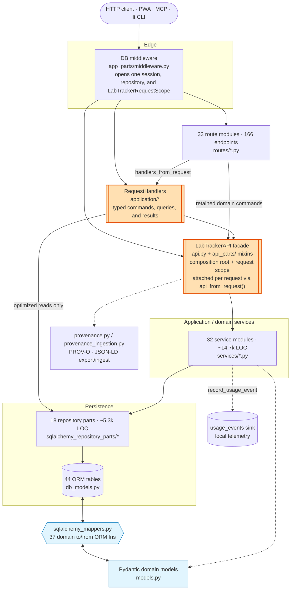

# Internal Boundaries

This document describes the active runtime boundaries only. Compatibility
surfaces that still exist for historical data handling or staged cleanup are
intentionally omitted unless they participate in the retained v1 runtime.

## Architecture at a Glance

A request traverses an explicit HTTP-to-application seam. Routes use a
request-scoped `RequestHandlers` aggregate for typed commands, optimized queries,
file operations, and managed deletes. Retained rich domain commands continue to
enter through the same per-request `LabTrackerAPI` facade. Entities are
represented as Pydantic domain models and SQLAlchemy ORM rows with an explicit
mapper seam between them.



Reading the diagram:

- **`RequestHandlers` (orange) is the HTTP application boundary.** The aggregate
  is composed once per request from the exact `LabTrackerAPI`, repository,
  SQLAlchemy session, storage backends, settings, and deferred-action queues
  already owned by middleware. Its focused owners (`CatalogQueries`,
  `ContextQueries`, `DatasetFileCommands`, `VisualizationFileCommands`, and
  `ManagedDeletionCommands`) return typed `Page`, `FileDownload`, and
  `AssetMutationResult` values. Routes never obtain a concrete repository or
  session.
- **`LabTrackerAPI` remains the retained domain-command boundary.** Handler
  commands use that same bound facade, and routes still use it for domain
  operations that do not need an optimized read model or cross-resource storage
  orchestration. The facade remains the single place where cross-cutting usage
  telemetry fires *exactly once per external call*. Services call each other's
  methods directly for internal composition (e.g. `graph_draft_applier`
  creating a claim), and those internal calls intentionally do **not** emit
  usage events. The scope machinery that owns both boundaries is described
  under [Request Context Lifecycle](#request-context-lifecycle).
- **The facade is composed, not monolithic.** `api.py` holds only the
  composition root (`_compose_services`) and the request-scope lifecycle. The
  ~150 delegation methods live in per-domain mixins under
  [`src/lab_tracker/api_parts`](../src/lab_tracker/api_parts) (`projects.py`,
  `notes.py`, `graph_drafts.py`, …), which `LabTrackerAPI` inherits. A change to
  one domain's surface touches that domain's mixin, not a single 1300-line file.
  The usage-telemetry helpers (`_with_usage_event`, `record_usage_event`) and the
  UUID/timing helpers in `api_parts/_base.py` are shared by all mixins.
- **Graph drafting has lifecycle owners behind a compatibility façade.**
  `GraphDraftService` preserves the flat method surface used by
  `api_parts/graph_drafts.py`, but every method is an explicit one-hop delegate:
  `GraphDraftGenerationCoordinator` builds and validates proposals,
  `GraphDraftReviewCoordinator` owns editing and human review,
  `TransactionalDraftCommitCoordinator` alone owns `GraphPatchApplier` and the
  atomic canonical commit, and `BatchSchedulingCoordinator` owns settings,
  workers, and due-run dispatch. `GraphDraftRecords` supplies their shared
  change-set/run record operations, while `graph_draft_batch_policy.py` contains
  deterministic batch identity, window, reviewer, and schedule rules. All five
  owners receive the exact same `ServiceContext`; scheduling calls generation
  directly, review calls a non-persisting generation seam for revisions, and no
  coordinator calls `GraphDraftService` or `LabTrackerAPI`. Usage telemetry
  therefore remains at the outer API façade and fires once.
- **The mapper + domain-model seam (blue) is the largest structural multiplier.**
  Each retained entity exists as a Pydantic domain type (`models.py`) and a
  SQLAlchemy row (`db_models.py`), joined by hand-written translators in
  `sqlalchemy_mappers.py`. This buys persistence-independent domain types at the
  cost of touching several layers per field change.
- **`provenance.py` and the `usage_events` sink are side outputs**, not part of
  the main read/write path — PROV-O export and local telemetry hang off the
  facade and services respectively.

Counts are approximate and drift as the code evolves; treat them as
orientation, not a contract.

## Request Context Lifecycle

Each HTTP request gets an explicit `LabTrackerRequestContext` in
[`src/lab_tracker/request_context.py`](../src/lab_tracker/request_context.py).
The scope machinery lives in
[`src/lab_tracker/api.py`](../src/lab_tracker/api.py), and the database
middleware that creates the request scope lives in
[`src/lab_tracker/app_parts/middleware.py`](../src/lab_tracker/app_parts/middleware.py).

The lifecycle is:

1. Authentication runs first. Exact host-I/O routes then pass independent,
   no-wait admission controls before the ordinary request database scope is
   allocated. Authentication services may use their own authoritative database
   sessions.
2. The database middleware creates a request-scoped SQLAlchemy repository.
3. `LabTrackerAPI.request_scope(...)` enters a `LabTrackerRequestScope` that owns:
   - the active repository
   - deferred `after_commit` and `after_rollback` actions
   - commit/rollback completion
   - session cleanup
4. The middleware composes `RequestHandlers` from that exact repository,
   SQLAlchemy session, `scope.api`, storage backends, settings, and optional
   resolver registry. It exposes only `scope.api` and the typed aggregate on
   request state; raw session and repository dependencies are not exposed.
5. Route adapters enter through `handlers_from_request(...)` for optimized
   queries, read-model assembly, file operations, and managed deletes. Retained
   domain calls use `api_from_request(...)`.
6. Read-only handlers that perform slow host I/O may first authorize and detach
   a value target, then call `release_read_scope()` to roll back and close the
   session before cache or adapter work. Data-store health follows this pattern;
   authorization still runs before every cache lookup.
7. On exit, `scope.complete_response(...)` commits successful responses and rolls back
   error responses. Unhandled exceptions roll back in `LabTrackerRequestScope.__exit__`.
8. Deferred side effects run only from the matching explicit scope outcome. Failures
   are logged and do not reverse the already-decided commit or rollback result.

Service logic should not depend on hidden globals or `ContextVar` state for request orchestration.

## Opaque Targeted-Read Ordering

Project- and group-scoped targeted reads follow one boundary order:

1. Authenticate the principal and apply coarse service-token capabilities,
   preserving `401` for missing or invalid credentials and `403` for a valid
   token outside its capability.
2. Validate the target locator, resolve only the scope needed for authorization,
   and map both an absent target and a denied target to the same canonical
   `404` response.
3. Complete that authorization before selecting children, indices, or hashes;
   hydrating the full record; attaching attribution; touching storage,
   resolvers, or health probes; or recording usage.
4. Only an authorized read may materialize and render the requested
   representation or perform those downstream actions.

Collection reads instead filter to accessible scopes, and mutations retain
explicit permission errors. The frozen targeted-read inventory and behavioral
suites are in [Read Opacity Inventory](read-opacity-inventory.md).

Known scope-adjacent exceptions:

- `GET /groups/{group_id}` is the equivalent group-scoped boundary.
  `lab-tracker-n5kp.33` is closed, and the route now conforms.
- `GET /projects/{project_id}/graph-draft-batch-settings` can still synthesize
  defaults for a missing project. `lab-tracker-n5kp.32` remains open, and this
  operation is outside the 37-variant inventory until that boundary is fixed.

## Application Handler Boundary

The request-scoped handlers live under
[`src/lab_tracker/application`](../src/lab_tracker/application):

- `catalog_queries.py` owns database-paged project-scoped catalogs. An empty
  accessible-project set is preserved as “no access”; only `None` means global
  access.
- `context_queries.py` owns assistant context, portfolio SQL, project graphs,
  provenance assembly, search, and bounded external-artifact resolution.
- `store_health_queries.py` owns opaque store authorization, immutable target
  detachment, early read-scope release, and the mandatory cached health-check
  port. The process-local cache contains completed probe results only; it never
  caches authorization.
- `file_commands.py` owns dataset and visualization blobs, including row locks,
  compare-and-set behavior, and rollback/commit cleanup registration.
- `managed_deletions.py` owns stable cascade lock ordering and post-commit
  cleanup of dataset, note, and visualization storage.
- `handlers.py` is the request composition root; `types.py` contains the
  transport-neutral result types.

This layer is intentionally allowed to use the optimized SQLAlchemy read models
and repository query surface. HTTP route modules are not. The architecture
guard in
[`tests/test_route_application_boundary.py`](../tests/test_route_application_boundary.py)
enforces that routes import neither SQLAlchemy nor persistence implementations,
cannot recover raw request session/repository state, and use the typed boundary
for the migrated surfaces.

The application modules own narrow structural `Protocol` ports beside each
consumer. `CatalogQueries`, `ContextQueries`, file commands, managed deletions,
decision-context assembly, and project-graph projection name only the
capabilities they call. The SQLAlchemy adapter satisfies those ports
structurally; it does not inherit the broad `LabTrackerRepository` protocol.
Broad entity-repository attributes are read-only protocol properties so focused
implementations remain covariant. `tests/typing/contracts.py` makes the adapter,
application facade, graph collaborators, and provider factories pass these
ports at compile time.

Graph generation, review, commit, and scheduling follow the same rule. Each
coordinator receives lifecycle-specific roles, and only the commit coordinator
receives the graph patch applier. Provider clients and their
`Callable[[Settings], GraphDraftClient]` factory stay typed from app startup
through request-state helpers and background dispatch. The compatibility API
uses explicit signatures matching `GraphDraftService`, including keyword-only
parameters and tri-state patch defaults.

Run the incremental strict boundary locally with:

```bash
uv run mypy
```

CI runs this alongside Ruff. The target list is intentionally incremental:
expand it as additional consumers acquire local ports rather than weakening
strictness for the existing boundary.

## Repository Layout

The SQLAlchemy repository is now split into focused modules under
[`src/lab_tracker/sqlalchemy_repository_parts`](../src/lab_tracker/sqlalchemy_repository_parts).

- `common.py`: shared pagination/count helpers and the generic model repository
- `core.py`: projects, project groups, project memberships, questions, and
  question refactors
- `datasets.py`: datasets and attached files
- `notes.py`: notes and note child rows
- `sessions.py`: sessions and acquisition outputs
- `analyses.py`: analyses, claims, and visualizations
- `goals.py`: goals and goal links
- `graph_drafts.py`: note-scoped graph change sets and operations
- `graph_batches.py`: graph-draft batch settings, runs, and batch summaries
- `ownership.py`: ownership reassignment and record export events
- `supervision.py`: supervision edges
- `usage.py`: local usage telemetry events and one-year rollups
- `versions.py`: entity version records
- `repository.py`: the top-level `SQLAlchemyLabTrackerRepository` query surface

[`src/lab_tracker/sqlalchemy_repository.py`](../src/lab_tracker/sqlalchemy_repository.py) remains as the import-stable compatibility barrel.
It is intentionally retained for existing callers; new internal code may import focused
repository modules directly when that makes ownership clearer.

## PROV-O Ingestion Seam

[`src/lab_tracker/provenance.py`](../src/lab_tracker/provenance.py) exports
retained-v1 dataset and analysis records as PROV-O / JSON-LD. The symmetric
ingestion seam lives in
[`src/lab_tracker/provenance_ingestion.py`](../src/lab_tracker/provenance_ingestion.py).

External tools should enter Lab Tracker through references, not reimplemented
workflows. An external artifact reference records:

- `kind`: `entity` or `activity`
- `source_system`: source tool name
- `uri`: canonical external URI
- `content_hash`: stable digest of the artifact or manifest
- `metadata`: tool-native metadata needed for traceability

For retained-v1 datasets, references live in
`DatasetCommitManifest.external_artifacts`. Older rows that encoded references
in `DatasetCommitManifest.metadata["external_artifacts"]` remain readable as a
legacy compatibility path. The provenance exporter turns both shapes into
first-class `prov:Entity` or `prov:Activity` nodes and links them to the dataset
commit activity. This keeps adapters optional and thin while preserving semantic
edges to questions and claims in Lab Tracker.

The retained-v1 ingestion helpers include thin DataLad and DVC import adapters in
`provenance_ingestion.py`. They accept exported manifests or `.dvc` pointer
content, create `DatasetCommitManifestInput` values, and do not require DataLad
or DVC as runtime dependencies.

## Database Artifacts

Root-level SQLite files such as `lab_tracker.db`, `*.db`, and
`lab_tracker.db.backup-*` are local runtime artifacts and are ignored by Git.
Committed database files should only exist when they are intentional fixtures under
`tests/fixtures/`, with nearby test documentation explaining why a binary fixture is
needed instead of migrations or factory setup.

## Route Layout

Mixed-resource route modules have been replaced with one-resource routers under
[`src/lab_tracker/routes`](../src/lab_tracker/routes).

Examples:

- `projects.py`, `questions.py`
- `groups.py`, `ownership.py`, `supervision.py`, `record_exports.py`,
  `portfolio.py`
- `datasets.py`, `dataset_files.py`
- `notes.py`, `search.py`
- `graph_drafts.py`, `graph_batches.py`, `project_graph.py`, `provenance.py`
- `sessions.py`, `analyses.py`, `claims.py`, `goals.py`, `visualizations.py`
- `auth.py`, `device_auth.py`, `assistant.py`, `schema.py`

Routes keep their existing URLs, envelopes, pagination, and auth requirements.
They translate HTTP inputs and outputs; database totals, authorization-aware
scope, storage sequencing, and deferred cleanup belong to the application
handlers.
`search.py` is the retained query surface and stays on the simple substring
behavior documented in
[`docs/retained-v1-surface.md`](retained-v1-surface.md),
not semantic/vector retrieval.

## Usage Telemetry Boundary

Usage telemetry is a local operator signal, not research provenance. Events enter
through `BaseService.record_usage_event(...)` and are persisted after the domain
commit or after an explicit request rollback for error outcomes. The active sink
is the local `usage_events` table; the seam exists so a future deployment can
replace it without changing route or service code.

Usage events must remain fixed-shape metadata: verb, resource type, UUIDs,
surface, actor role/principal, outcome, duration, and result count. They must not
contain titles, note bodies, descriptions, transcripts, filenames, search query
strings, request bodies, or raw URL paths. The telemetry export routes are
separate from `provenance.py`; usage rows are not part of PROV-O/JSON-LD export.

## Frontend Data Loading and Downloads

Workspace state is no longer concentrated in one hook.

- [`useProjectWorkspaceData.js`](../src/lab_tracker/frontend_src/hooks/useProjectWorkspaceData.js) owns project/resource loading and selection
- [`useProjectWorkspaceForms.js`](../src/lab_tracker/frontend_src/hooks/useProjectWorkspaceForms.js) owns form state
- [`useProjectActions.js`](../src/lab_tracker/frontend_src/hooks/useProjectActions.js),
  [`useQuestionActions.js`](../src/lab_tracker/frontend_src/hooks/useQuestionActions.js),
  [`useNoteActions.js`](../src/lab_tracker/frontend_src/hooks/useNoteActions.js),
  and [`useSessionActions.js`](../src/lab_tracker/frontend_src/hooks/useSessionActions.js)
  own the workspace mutations for their resources
- [`useProjectNoteData.js`](../src/lab_tracker/frontend_src/hooks/useProjectNoteData.js)
  and [`useProjectSessionData.js`](../src/lab_tracker/frontend_src/hooks/useProjectSessionData.js)
  own focused project-scoped note and session loading
- [`useDatasetWorkflow.js`](../src/lab_tracker/frontend_src/hooks/useDatasetWorkflow.js)
  and [`useAnalysisWorkflow.js`](../src/lab_tracker/frontend_src/hooks/useAnalysisWorkflow.js)
  own the dataset, analysis, claim, visualization, and related refresh flows
- [`useApiResource.js`](../src/lab_tracker/frontend_src/hooks/useApiResource.js) owns detail-page resource loading for single-record routes

Protected browser downloads must go through
[`downloadProtectedResource(...)`](../src/lab_tracker/frontend_src/shared/api.js),
not plain anchors, so bearer-token auth is preserved for note raw assets and dataset files.

Oversized feature modules now export smaller workflow components from focused folders under
[`src/lab_tracker/frontend_src/features`](../src/lab_tracker/frontend_src/features).
