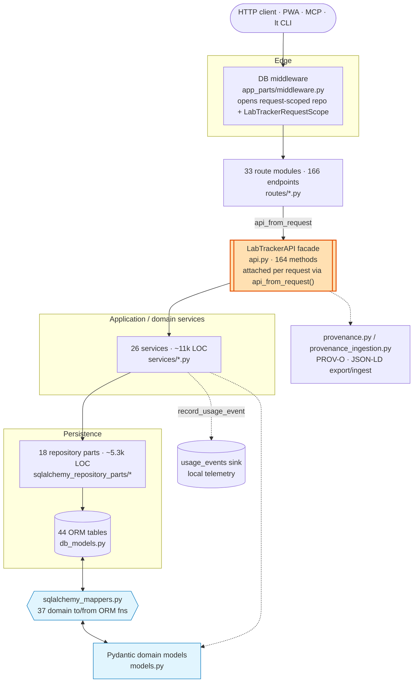

# Internal Boundaries

This document describes the active runtime boundaries only. Compatibility
surfaces that still exist for historical data handling or staged cleanup are
intentionally omitted unless they participate in the retained v1 runtime.

## Architecture at a Glance

A request traverses five layers. Every route reaches the rest of the system
through a single per-request `LabTrackerAPI` facade; entities are represented as
Pydantic domain models and SQLAlchemy ORM rows with an explicit mapper seam
between them.

Reading the diagram:

- **`LabTrackerAPI` (orange) is the central chokepoint.** All 33 route modules
  delegate to this one per-request facade rather than importing services
  directly, so it concentrates both wiring and change-risk. The scope machinery
  that owns it is described under [Request Context Lifecycle](#request-context-lifecycle).
- **The mapper + domain-model seam (blue) is the largest structural multiplier.**
  Each retained entity exists as a Pydantic domain type (`models.py`) and a
  SQLAlchemy row (`db_models.py`), joined by hand-written translators in
  `sqlalchemy_mappers.py`. This buys persistence-independent domain types at the
  cost of touching several layers per field change.
- **`provenance.py` and the `usage_events` sink are side outputs**, not part of
  the main read/write path — PROV-O export and local telemetry hang off the
  facade and services respectively.

Counts are approximate and drift as the code evolves; treat them as
orientation, not a contract.

## Request Context Lifecycle

Each HTTP request gets an explicit `LabTrackerRequestContext` in
[`src/lab_tracker/request_context.py`](../src/lab_tracker/request_context.py).
The scope machinery lives in
[`src/lab_tracker/api.py`](../src/lab_tracker/api.py), and the database
middleware that creates the request scope lives in
[`src/lab_tracker/app_parts/middleware.py`](../src/lab_tracker/app_parts/middleware.py).

The lifecycle is:

1. The database middleware creates a request-scoped SQLAlchemy repository.
2. `LabTrackerAPI.request_scope(...)` enters a `LabTrackerRequestScope` that owns:
   - the active repository
   - deferred `after_commit` and `after_rollback` actions
   - commit/rollback completion
   - session cleanup
3. The middleware attaches `scope.api` to `request.state.lab_tracker_api`.
4. Route handlers use `request.state.lab_tracker_api` via `api_from_request(...)`.
5. On exit, `scope.complete_response(...)` commits successful responses and rolls back
   error responses. Unhandled exceptions roll back in `LabTrackerRequestScope.__exit__`.
6. Deferred side effects run only from the matching explicit scope outcome. Failures
   are logged and do not reverse the already-decided commit or rollback result.

Service logic should not depend on hidden globals or `ContextVar` state for request orchestration.

## Repository Layout

The SQLAlchemy repository is now split into focused modules under
[`src/lab_tracker/sqlalchemy_repository_parts`](../src/lab_tracker/sqlalchemy_repository_parts).

- `common.py`: shared pagination/count helpers and the generic model repository
- `core.py`: projects, project groups, project memberships, questions, and
  question refactors
- `datasets.py`: datasets and attached files
- `notes.py`: notes and note child rows
- `sessions.py`: sessions and acquisition outputs
- `analyses.py`: analyses, claims, and visualizations
- `goals.py`: goals and goal links
- `graph_drafts.py`: note-scoped graph change sets and operations
- `graph_batches.py`: graph-draft batch settings, runs, and batch summaries
- `ownership.py`: ownership reassignment and record export events
- `supervision.py`: supervision edges
- `usage.py`: local usage telemetry events and one-year rollups
- `versions.py`: entity version records
- `repository.py`: the top-level `SQLAlchemyLabTrackerRepository` query surface

[`src/lab_tracker/sqlalchemy_repository.py`](../src/lab_tracker/sqlalchemy_repository.py) remains as the import-stable compatibility barrel.
It is intentionally retained for existing callers; new internal code may import focused
repository modules directly when that makes ownership clearer.

## PROV-O Ingestion Seam

[`src/lab_tracker/provenance.py`](../src/lab_tracker/provenance.py) exports
retained-v1 dataset and analysis records as PROV-O / JSON-LD. The symmetric
ingestion seam lives in
[`src/lab_tracker/provenance_ingestion.py`](../src/lab_tracker/provenance_ingestion.py).

External tools should enter Lab Tracker through references, not reimplemented
workflows. An external artifact reference records:

- `kind`: `entity` or `activity`
- `source_system`: source tool name
- `uri`: canonical external URI
- `content_hash`: stable digest of the artifact or manifest
- `metadata`: tool-native metadata needed for traceability

For retained-v1 datasets, references live in
`DatasetCommitManifest.external_artifacts`. Older rows that encoded references
in `DatasetCommitManifest.metadata["external_artifacts"]` remain readable as a
legacy compatibility path. The provenance exporter turns both shapes into
first-class `prov:Entity` or `prov:Activity` nodes and links them to the dataset
commit activity. This keeps adapters optional and thin while preserving semantic
edges to questions and claims in Lab Tracker.

The retained-v1 ingestion helpers include thin DataLad and DVC import adapters in
`provenance_ingestion.py`. They accept exported manifests or `.dvc` pointer
content, create `DatasetCommitManifestInput` values, and do not require DataLad
or DVC as runtime dependencies.

## Database Artifacts

Root-level SQLite files such as `lab_tracker.db`, `*.db`, and
`lab_tracker.db.backup-*` are local runtime artifacts and are ignored by Git.
Committed database files should only exist when they are intentional fixtures under
`tests/fixtures/`, with nearby test documentation explaining why a binary fixture is
needed instead of migrations or factory setup.

## Route Layout

Mixed-resource route modules have been replaced with one-resource routers under
[`src/lab_tracker/routes`](../src/lab_tracker/routes).

Examples:

- `projects.py`, `questions.py`
- `groups.py`, `ownership.py`, `supervision.py`, `record_exports.py`,
  `portfolio.py`
- `datasets.py`, `dataset_files.py`
- `notes.py`, `search.py`
- `graph_drafts.py`, `graph_batches.py`, `project_graph.py`, `provenance.py`
- `sessions.py`, `analyses.py`, `claims.py`, `goals.py`, `visualizations.py`
- `auth.py`, `device_auth.py`, `assistant.py`, `schema.py`

Routes keep their existing URLs, envelopes, pagination, and auth requirements.
`search.py` is the retained query surface and stays on the simple substring
behavior documented in
[`docs/retained-v1-surface.md`](retained-v1-surface.md),
not semantic/vector retrieval.

## Usage Telemetry Boundary

Usage telemetry is a local operator signal, not research provenance. Events enter
through `BaseService.record_usage_event(...)` and are persisted after the domain
commit or after an explicit request rollback for error outcomes. The active sink
is the local `usage_events` table; the seam exists so a future deployment can
replace it without changing route or service code.

Usage events must remain fixed-shape metadata: verb, resource type, UUIDs,
surface, actor role/principal, outcome, duration, and result count. They must not
contain titles, note bodies, descriptions, transcripts, filenames, search query
strings, request bodies, or raw URL paths. The telemetry export routes are
separate from `provenance.py`; usage rows are not part of PROV-O/JSON-LD export.

## Frontend Data Loading and Downloads

Workspace state is no longer concentrated in one hook.

- [`useProjectWorkspaceData.js`](../src/lab_tracker/frontend_src/hooks/useProjectWorkspaceData.js) owns project/resource loading and selection
- [`useProjectWorkspaceForms.js`](../src/lab_tracker/frontend_src/hooks/useProjectWorkspaceForms.js) owns form state
- [`useProjectActions.js`](../src/lab_tracker/frontend_src/hooks/useProjectActions.js),
  [`useQuestionActions.js`](../src/lab_tracker/frontend_src/hooks/useQuestionActions.js),
  [`useNoteActions.js`](../src/lab_tracker/frontend_src/hooks/useNoteActions.js),
  and [`useSessionActions.js`](../src/lab_tracker/frontend_src/hooks/useSessionActions.js)
  own the workspace mutations for their resources
- [`useProjectNoteData.js`](../src/lab_tracker/frontend_src/hooks/useProjectNoteData.js)
  and [`useProjectSessionData.js`](../src/lab_tracker/frontend_src/hooks/useProjectSessionData.js)
  own focused project-scoped note and session loading
- [`useDatasetWorkflow.js`](../src/lab_tracker/frontend_src/hooks/useDatasetWorkflow.js)
  and [`useAnalysisWorkflow.js`](../src/lab_tracker/frontend_src/hooks/useAnalysisWorkflow.js)
  own the dataset, analysis, claim, visualization, and related refresh flows
- [`useApiResource.js`](../src/lab_tracker/frontend_src/hooks/useApiResource.js) owns detail-page resource loading for single-record routes

Protected browser downloads must go through
[`downloadProtectedResource(...)`](../src/lab_tracker/frontend_src/shared/api.js),
not plain anchors, so bearer-token auth is preserved for note raw assets and dataset files.

Oversized feature modules now export smaller workflow components from focused folders under
[`src/lab_tracker/frontend_src/features`](../src/lab_tracker/frontend_src/features).
